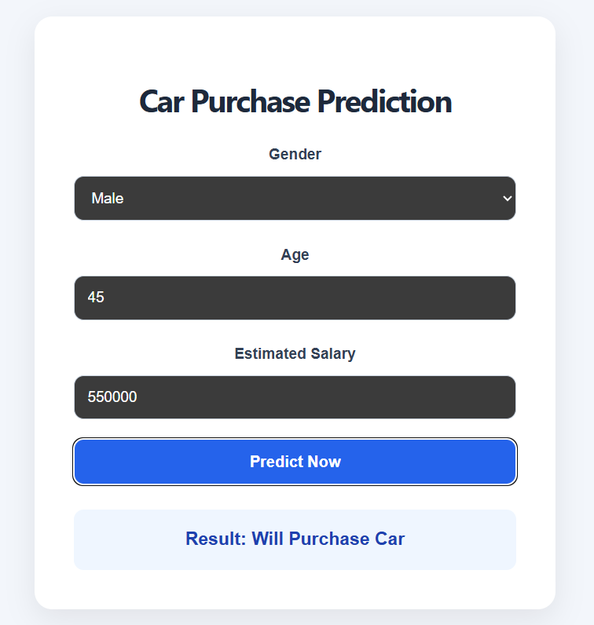
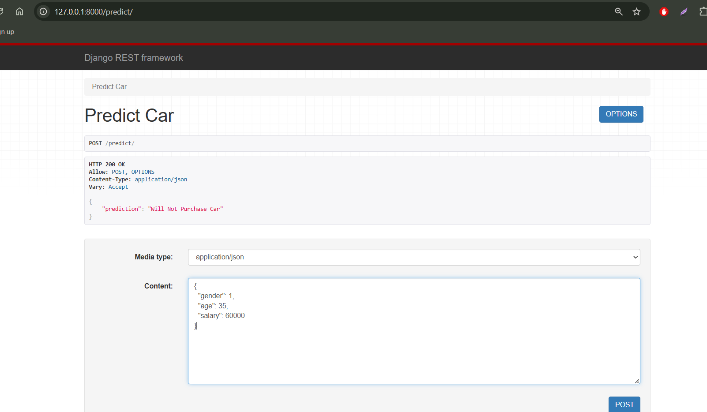

# Smart Car Purchase Prediction

Smart Car Purchase Prediction is a machine learning project that predicts whether a customer will purchase a car or not using details like gender, age, and salary.

## Technologies Used

* Python
* Machine Learning
* NumPy
* Pandas
* Scikit-learn
* REST API
* Django REST Framework
* React.js

## Features

* Car purchase prediction using ML model
* REST API integration
* React frontend interface
* Fast prediction results

## Project Screenshots

### Home Page

### Prediction Result

## How to Run

### Backend

Open terminal in the Smart Car Purchase Predictor folder and run:

python manage.py runserver

### Frontend

Open a new terminal and go to the frontend folder:

cd Frontend_React

If creating the frontend for the first time:

npm create vite@latest

Choose:

* Framework → React
* Variant → JavaScript

Then run:

npm install
npm run dev
